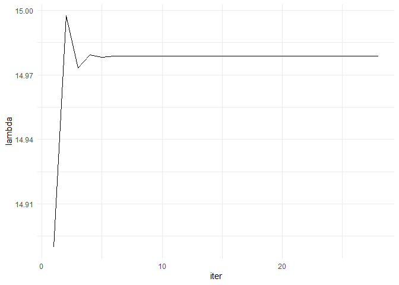

<!-- README.md is generated from README.Rmd. Please edit that file -->

# appm3310.final

This R package contains computation work for the APPM 3310 final
project.

## Installation

To use the package, you first need to install it.

You can install the development version of appm3310.final like so:

``` r
remotes::install_git("https://github.com/joshwlivingston/appm3310.final")
```

Once installed, load the package with `library(appm3310.final)`

``` r
library(appm3310.final)
```

## Prepared data

You can load the cleaned data itself, which is loaded with the package

``` r
ncaam |> head()
#>                       team       date home_away                      opp result
#> 1              Texas State 2023-11-06      away              Little Rock      L
#> 2             Grand Canyon 2023-11-06      home Southeast Missouri State      W
#> 3 Mississippi Valley State 2023-11-06      away          Louisiana State      L
#> 4                 Southern 2023-11-06      away                      TCU      L
#> 5            Jackson State 2023-11-06      away                  Memphis      L
#> 6                  Pacific 2023-11-06      home        Sam Houston State      L
#>   team_score opp_score
#> 1         66        71
#> 2         88        67
#> 3         60       106
#> 4         75       108
#> 5         77        94
#> 6         57        64
```

<br>

## Data Prep

Alternatively, you can read the raw data and clean it using a provided
helper function.

### Raw data

The data was collected from
[sports-reference.com](https://stathead.com/basketball/cbb/team-game-finder.cgi?request=1&comp_type=reg&game_status=1&order_by=date&match=team_game&year_max=2024&order_by_asc=1&timeframe=seasons&comp_id=NCAAM&year_min=2024).
Currently, data for the 2023-24 NCAA men’s basketball regular season has
been collected. The data contains team-game level results for all NCAA
men’s basketball games. That is, there are two rows for each game in the
data, one per team.You can call `read_ncaa_data(league = "NCAAM")` to
read the raw data.

If using `read_ncaa_data()`, you’ll need to authenticate with your
Google sheets account.

``` r
ncaam_raw <- read_ncaa_data(league = "NCAAM")
```

### Cleaned data

You will have to clean the data before using it. You can do so using
`clean_ncaa_data()`.

``` r
ncaam_cleaned <- ncaam_raw |> clean_ncaa_data()
```

## Prepare for computation

To prepare the data for ranking computation, you need to convert teh
data to square matrix form. The functions in the
`ranking_table_prep_*()` are the first step.

### Prepare ranking table

You can prepare the matrix for ranking using the direct win-loss method
using `ranking_table_prep_direct_win_loss()`. This method assigns a 0
for a loss, 0.5 for a tie, and 1 for a win, then sums the results across
games.

``` r
ncaam_prepared <- 
  ncaam |> 
  ranking_table_prep_direct_win_loss()
```

<br>

Looking at the teams that made it to the final four, you can validate
regular season results. Use `view_subset()` to filter the matrix to
specific teams.

``` r
library(dplyr)
final_four <- c("NC State", "Purdue", "Tennessee", "Duke")
ncaam_prepared |> view_subset(final_four)
#> # A tibble: 4 × 5
#>   team      `NC State` Purdue Tennessee  Duke
#>   <chr>          <dbl>  <dbl>     <dbl> <dbl>
#> 1 Duke               1      0         0     0
#> 2 NC State           0      0         0     0
#> 3 Purdue             0      0         1     0
#> 4 Tennessee          1      0         0     0
```

<br>

### Convert table to matrix

Then, you’ll have to convert the table to matrix form, which is done
with the function `to_matrix()`.

``` r
ncaam_matrix <- 
  ncaam_prepared |> 
    to_matrix()

dim(ncaam_matrix)
#> [1] 362 362
```

<br>

### Matrix tests

`to_matrix()` calls two checks to ensure the data is ready for
computation. These functions do not print anything; they simply error if
needed to. These checks are performed automatically. <br>

`check_is_square()` checks that the matrix has equal dimensions.

``` r
ncaam_matrix |> check_is_square()
```

<br>

`check_nonnegative_matrix()` checks that all values in the matrix are
\>= 0

``` r
ncaam_matrix |> check_nonnegative_matrix()
```

<br>

## Computing eigenvalues

After preparing the matrix, you can compute eigenvalues. For the example
above, we use the power method to approximate the eigenvalues.
`eigenvalues_power_method()` defaults to 1000 maximum iterations, and a
convergence tolerance of 1e-10. These can be altered as arguments to the
function. For more details, see `?eigenvalues_power_method`.

``` r
ncaam_eigenvalues <- 
  ncaam_matrix |> 
  eigenvalues_power_method()
```

<br>

`eigenvalues_power_method()` returns a list with two tibbles: the
eigenvalues, and the results from the iteration.

``` r
str(ncaam_eigenvalues)
#> List of 2
#>  $ eigenvalue_table: tibble [362 × 2] (S3: tbl_df/tbl/data.frame)
#>   ..$ team       : chr [1:362] "Little Rock" "Southeast Missouri State" "Louisiana State" "TCU" ...
#>   ..$ eigenvector: num [1:362] 8.19e+32 1.25e+33 3.32e+31 8.70e+32 7.85e+32 ...
#>  $ lambda_table    : tibble [28 × 2] (S3: tbl_df/tbl/data.frame)
#>   ..$ iter  : int [1:28] 1 2 3 4 5 6 7 8 9 10 ...
#>   ..$ lambda: num [1:28] 14.9 15 15 15 15 ...
```

<br>

To view the results from the iteration, you can call `plot_lambdas()`

``` r
ncaam_eigenvalues |> plot_lambdas()
```



To compute the rankings, you can call `rankings_from_eigenvalues()`

``` r
ncaam_eigenvalues |> 
  rankings_from_eigenvalues() |> 
  head(10)
#> # A tibble: 10 × 3
#>    team             eigenvector  rank
#>    <chr>                  <dbl> <dbl>
#>  1 Michigan State       1.64e33     1
#>  2 Samford              1.60e33     2
#>  3 VCU                  1.52e33     3
#>  4 Sacramento State     1.47e33     4
#>  5 Purdue               1.43e33     5
#>  6 Lindenwood           1.41e33     6
#>  7 Louisiana–Monroe     1.41e33     7
#>  8 Texas State          1.39e33     8
#>  9 Eastern Illinois     1.38e33     9
#> 10 High Point           1.38e33    10
```

<br><br>
